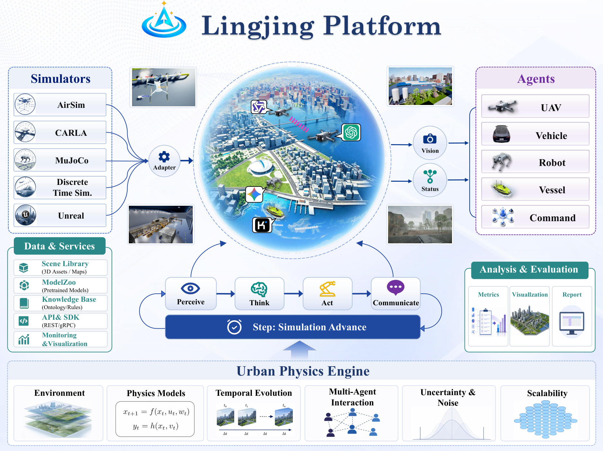
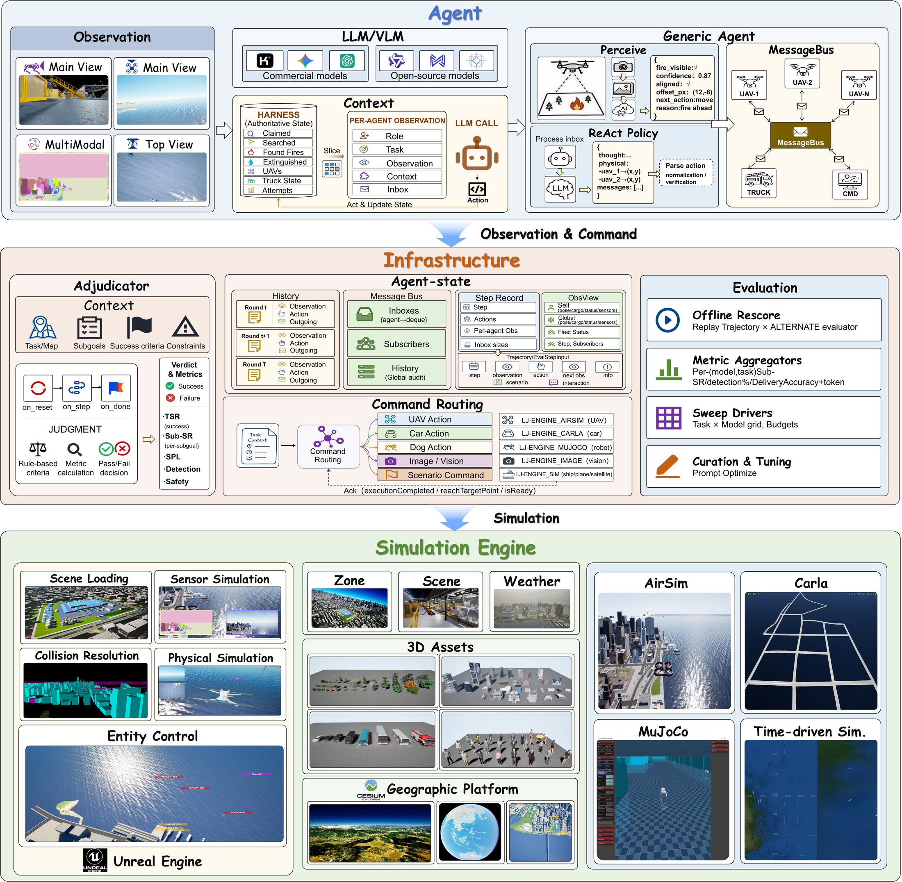

<div align="center">

# 🌐 灵境具身智能仿真平台

**面向大规模三维环境中 LLM 驱动具身智能体的开放仿真工程。**

<a href="./README.md"></a>
<a href="./README.zh-CN.md"></a>

</div>

LingJing 将 FastAPI/LangGraph 后端、可运行的具身智能案例和基于 Cesium 的 Unreal Engine 5.5 插件整理在同一仓库中。后端负责任务编排、LLM/VLM 调用、Gym 风格环境循环、引擎通信和数据记录；UE 插件负责三维场景接入、异构装备 Actor、相机、UI、图像采集与遥测。

大型 Unreal 资产通过 Hugging Face 单独分发。本仓库仅包含源码、配置模板、测试和小型案例数据。

## 🗺️ 平台概览

<p align="center">
  
</p>

LingJing 通过统一的城市物理环境连接异构仿真器、地理空间资产、模型服务和具身智能体。每个仿真步形成“感知—思考—行动—通信”闭环，并记录可用于评估和可视化的结果。[查看高清 PDF](docs/figures/earth.pdf)。

## 🧩 运行框架

<p align="center">
  
</p>

运行框架将智能体策略、共享基础设施、裁决、命令路由、评估和仿真引擎分层组织。策略无需感知具体引擎协议，同时保留逐智能体观测、消息历史、执行确认和可回放轨迹。[查看高清 PDF](docs/figures/framework.pdf)。

## ✨ 核心能力

- 支持集中式、星型和广播式协作的多智能体任务编排。
- 提供 `reset`、`step`、`run`、`close` 生命周期和可插拔评估器。
- 支持 OpenAI-compatible 与 Anthropic-compatible 模型服务。
- 通过 HTTP、WebSocket 和 UDP 与 Unreal Engine 通信。
- 基于 Cesium 的城市仿真，覆盖无人机、车辆、机器狗、船舶和任务 Actor。
- 提供 Mock Engine，不安装 Unreal Engine 也能开发和测试后端。

## 仓库结构

```text
LingJing-Embodied-Intelligence/
├── backend/
│   ├── app/                 # FastAPI 应用与运行模块
│   ├── examples/            # 可运行案例与 UE 参考客户端
│   ├── tests/               # API、环境和实时通信测试
│   ├── scripts/             # 部署与维护脚本
│   └── .env.example         # 安全的配置模板
├── unreal/
│   └── EmbodyIntelligence/  # Unreal Engine 5.5 Runtime 插件
├── docs/                    # README 图片与高清 PDF
├── ASSETS.md                # Hugging Face 资产说明
└── README.md                # 英文文档
```

## 🚀 后端快速开始

需要 Python 3.10 或更高版本。

```bash
cd backend
python -m venv .venv
source .venv/bin/activate
pip install -r requirements-dev.txt
cp .env.example .env
```

在 `.env` 中填写自己的模型服务信息：

```dotenv
AI_BASE_URL=https://api.example.com/v1
AI_API_KEY=replace-with-your-api-key
AI_CHAT_MODEL=replace-with-your-chat-model
AI_ANALYSIS_MODEL=replace-with-your-vision-model
AI_API_STYLE=openai
INTERNAL_AI_TOKEN=replace-with-a-long-random-token
```

启动服务：

```bash
uvicorn app.main:app --reload --host 0.0.0.0 --port 9909
```

检查服务：

```bash
curl http://127.0.0.1:9909/health
```

- Swagger UI：`http://127.0.0.1:9909/docs`
- 引擎会话：`http://127.0.0.1:9909/websocket/api/sessions`

无需 Unreal Engine 和 API Key 即可运行端到端 Mock 案例：

```bash
python examples/scenario_demo.py
```

## 🧠 可运行案例

| 目录 | 场景 |
| --- | --- |
| `examples/full_case/` | 城市多无人机配送及集中式基线 |
| `examples/fire_rescue/` | 无人机侦察与无人车灭火 |
| `examples/singledrone_fire/` | 单无人机闭环视觉火点搜索 |
| `examples/singledog/` | 机器狗视觉导航 |
| `examples/deliverytask/` | 异构配送与路线巡检 |
| `examples/bridge/` | 桥梁俯视与前视巡检 |
| `examples/multicars/` | 多车调度与路径代价分析 |
| `examples/uavdog/` | 无人机辅助机器狗导航 |
| `examples/multiagentstasks/` | 混合装备想定下发 |
| `examples/ue_client/` | Python 引擎客户端参考实现 |

运行命令和依赖见 [backend/examples/README.md](backend/examples/README.md)。

## 🏙️ Unreal Engine 接入

需要：

- Unreal Engine 5.5.4
- Cesium for Unreal
- 一个宿主 Unreal 项目
- 与源码版本匹配的 Hugging Face 资产包

将插件安装到：

```text
<HostProject>/Plugins/EmbodyIntelligence/
```

资产仓库地址：

```text
Coming soon / 即将上传
```

将下载后的资产分别安装到两个挂载位置：

```text
<HostProject>/Plugins/EmbodyIntelligence/Content/  # PluginContent
<HostProject>/Content/                            # HostContent
```

`Program` 资产使用 `/EmbodyIntelligence/...` 插件挂载点，场景资产使用 `/Game/ArtRes/...` 宿主项目挂载点。完整说明见 [ASSETS.zh-CN.md](ASSETS.zh-CN.md) 和 [unreal/EmbodyIntelligence/README.zh-CN.md](unreal/EmbodyIntelligence/README.zh-CN.md)。

插件默认连接：

```text
ws://127.0.0.1:9909/ws/LJ-ENGINE/image
```

远程部署时，请在编译前修改 `Source/ue5project/Core/DataManager.cpp` 中的 `WEBSOCKET_URL`。

## 🧪 检查

```bash
cd backend
python -m pytest -q
python -m ruff check app examples tests
```

UE 插件需要在启用 Cesium 的 Unreal Engine 5.5.4 中编译。仓库不会提交 `Binaries/`、`Intermediate/`、日志、数据库、上传文件和运行结果。

## 安全说明

- 不要提交 `.env`、API Key、访问令牌、数据库、上传图片或运行日志。
- 部署前替换 `.env.example` 中的全部占位符。
- 任何曾出现在源码或共享压缩包中的真实凭据都应立即轮换。
- WebSocket 日志和截图可能包含敏感数据，应按生产数据管理。
- 发布 Hugging Face 资产前检查所有第三方许可证和再分发权限。

## GitHub 信息

建议 Description：

> Open embodied-intelligence simulation stack with a FastAPI/LangGraph multi-agent backend, reproducible urban task cases, and a Cesium-powered Unreal Engine 5.5 plugin.

建议 Topics：`embodied-ai`、`multi-agent`、`unreal-engine`、`ue5`、`cesium`、`simulation`、`robotics`、`langgraph`、`fastapi`、`digital-twin`。

## License

当前发布包尚未选择许可证。确认源码及 Unreal/Hugging Face 资产的再分发条件后，再添加 `LICENSE`。
